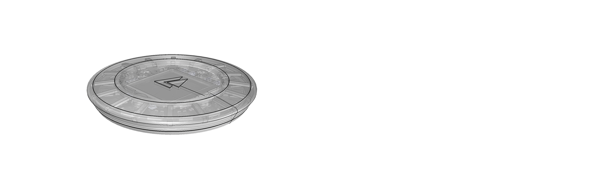

# Section visualizer - WIP

The section visualizer is a Python script developed for Rhino using the [RhinoScriptSyntax](https://github.com/mcneel/rhinoscriptsyntax) library. It automatically generates a sequence of axonometric and flat section views highlighting the sections curves extracted from a Rhino 3D model.

The development of this script arises from the need of quickly and efficiently generating an image or animation that easily explains and exposes the complex internal geometries of a 3D part to customers who are not familiar with 3D modeling tools.

## To be added:

+ Plane and UV direction selector.

+ Viewport settings standardization.

+ Section line width and color editor.

+ Photoshop script to automate gif creation.

+ Visualizing GUI to allow sliding through images and exporting animations.

## License:

The Plain Contract is licensed under a [Creative Commons Attribution-NonCommercial-NoDerivatives 4.0 International License](https://creativecommons.org/licenses/by-nc-nd/4.0/). This means, you are free to share and redistribute the material in any medium or format under the following terms:

- Attribution - You must give appropriate credit, provide a link to the license, and indicate if changes were made. You may do so in any reasonable manner, but not in any way that suggests the licensor endorses you or your use.

- NonCommercial - You may not use the material for commercial purposes.

- NoDerivatives - If you remix, transform, or build upon the material, you may not distribute the modified material.

- No additional restrictions - You may not apply legal terms or technological measures that legally restrict others from doing anything the license permits.
